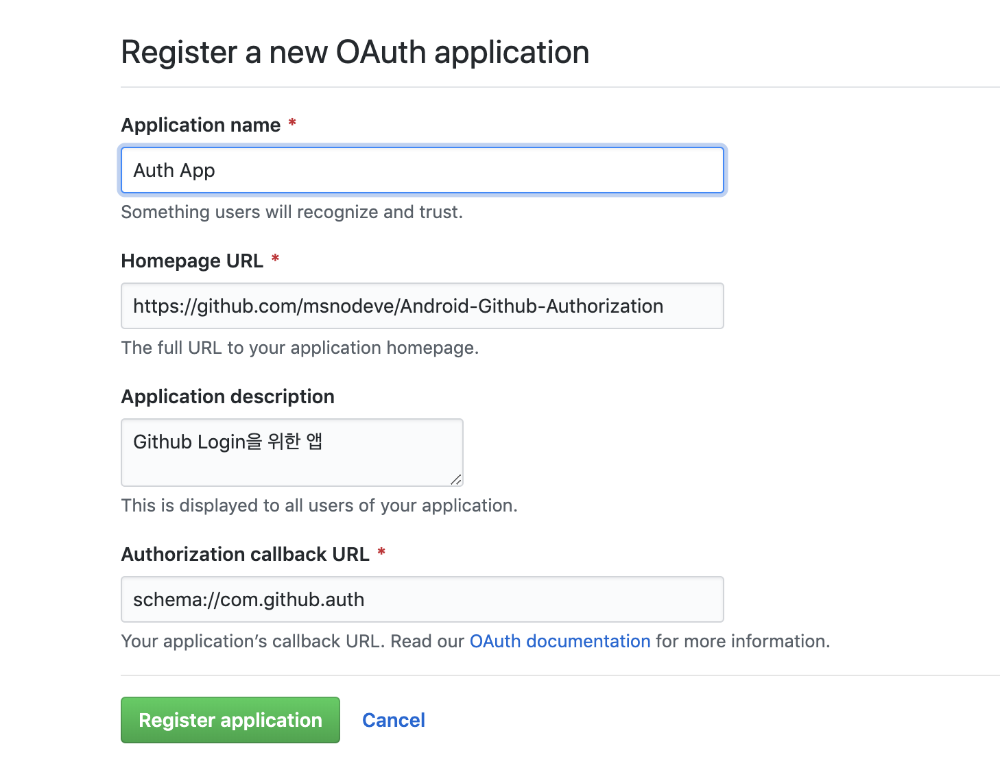
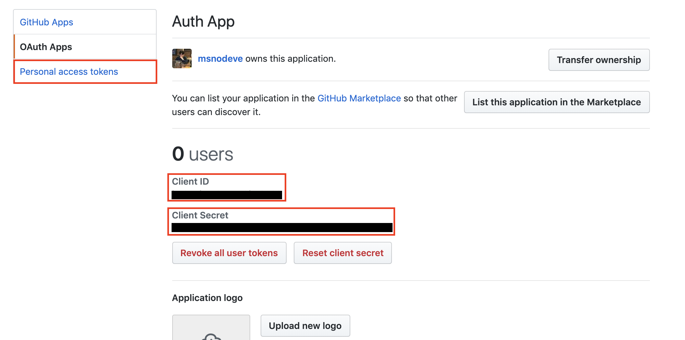
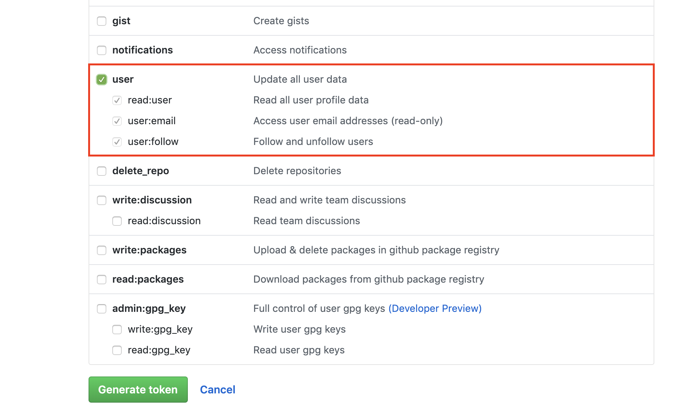
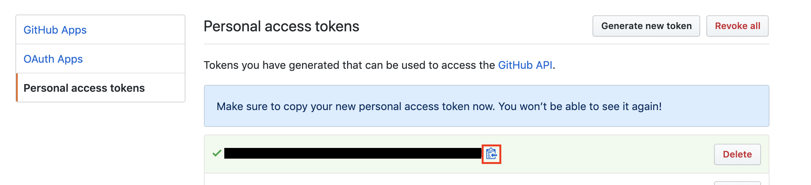
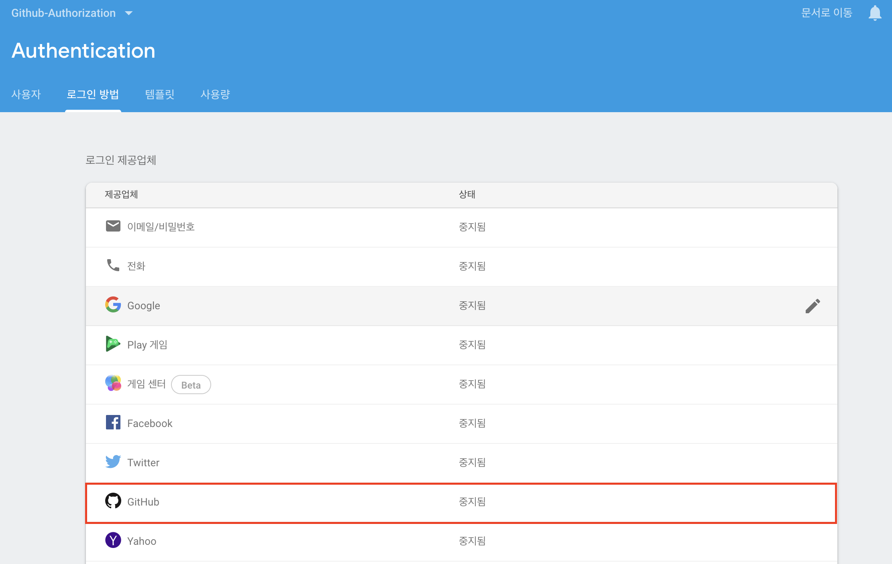
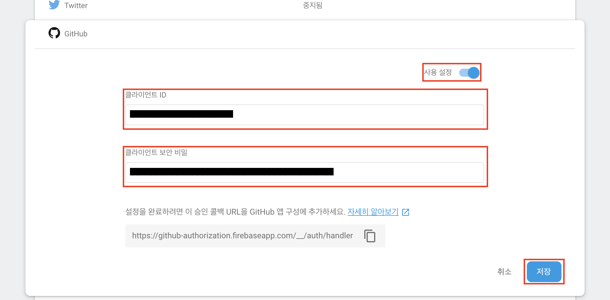

# Github Authorization
[](https://travis-ci.org/msnodeve/Android-Github-Authorization) [](https://coveralls.io/github/msnodeve/Android-Github-Authorization?branch=master)

***

## Develop env

- MacBook Pro (13-inch, 2017, Four Thunderbolt 3 Ports)
- Android Studio 3.4


## Introduce

```
minSdkVersion 19
targetSdkVersion 28
```


## Getting Started

[[Firebase Project Setting\]](https://firebase.google.com/docs/android/setup) 으로 가서 설명서 대로 프로젝트를 생성하기 build.gradle(project)

```
buildscript {
    // ...
    dependencies {
        // ...
        classpath 'com.google.gms:google-services:4.1.0'
    }
}
```

build.gradle(app)

```
apply plugin: 'kotlin-android-extensions' // 익스텐션 플러그인 적용

dependencies {
  // ...

  // Firebase
  implementation 'com.google.firebase:firebase-core:16.0.7'
  // Firebase Auth
  implementation 'com.google.firebase:firebase-auth:16.1.0'
  // Using the OkHttp Library for HTTP Networking
  implementation 'com.squareup.okhttp3:okhttp:3.8.1'
  // Using the Glide Library for Image loading
  implementation 'com.github.bumptech.glide:glide:3.7.0'
}

// ADD THIS AT THE BOTTOM
apply plugin: 'com.google.gms.google-services'
```


## Github OAuth Application

Github 로그인 후 Settings > Developer settings > OAuth Apps > New OAuth App 클릭



- Application name : 현재 만들려 하는 OAuth App 이름
- Homeapge URL : 제작하려는 앱의 깃허브 레포 위치를 넣음
- Application description : 앱에 대한 설명
- Authorization callback URL : 깃허브에 요청이 들어왔을 때 응답 콜백 받을 URL

생성 후 Client ID, Client Secret을 기억 하고 Token을 생성하도록 함



Personal access tokens > Generate new token 클릭 후 다음과 같이 설정






## Firebase 콘솔에서 GitHub 인증 사용



아래의 URL은 쓰지 않음



## GitHub 인증 통합

[[Github 공식 문서\]](https://developer.github.com/apps/building-oauth-apps/authorizing-oauth-apps/)를 따라 통합

**Redirect_url을 받을 XML에 선언 <data android:scheme="[yourschema]">를 지정**

```
<?xml version="1.0" encoding="utf-8"?>
<manifest xmlns:android="<http://schemas.android.com/apk/res/android>"
          package="com.seok.github_authorization">
    <uses-permission android:name="android.permission.INTERNET" />
    <application
            android:allowBackup="true"
            android:icon="@mipmap/ic_launcher"
            android:label="@string/app_name"
            android:roundIcon="@mipmap/ic_launcher_round"
            android:supportsRtl="true"
            android:theme="@style/AppTheme">
        <activity
                android:name=".RedirectedActivity"
                android:theme="@android:style/Theme.Translucent.NoTitleBar">
            <intent-filter>
                <action android:name="android.intent.action.VIEW" />

                <category android:name="android.intent.category.DEFAULT" />
                <category android:name="android.intent.category.BROWSABLE" />

                <data android:scheme="schema" />
            </intent-filter>
        </activity>
        <activity android:name=".LoginActivity">
            <intent-filter>
                <action android:name="android.intent.action.MAIN"/>

                <category android:name="android.intent.category.LAUNCHER"/>
            </intent-filter>
        </activity>
        <activity android:name=".MainActivity">
        </activity>
    </application>

</manifest>
```

**사용자가 GitHub ID를 요청하도록 리디렉션**

```
//LoginActivity
private fun signIn() {
        var httpUrl :HttpUrl = HttpUrl.Builder()
            .scheme("https")
            .host("github.com")
            .addPathSegment("login")
            .addPathSegment("oauth")
            .addPathSegment("authorize")
            .addQueryParameter("client_id", getString(R.string.github_app_id))
            .addQueryParameter("scope", "user:email")
            .build()
        var intent : Intent = Intent(Intent.ACTION_VIEW, Uri.parse(httpUrl.toString()))
        Log.d("testtest", httpUrl.toString())
        startActivityForResult(intent, StatusCode.REQUEST_GITHUB_REDIRECT)
    }
```

**사용자 GitHub에 의해 사이트로 리디렉션**

```
// RedirectedActivity
class RedirectedActivity : Activity() {
    override fun onCreate(savedInstanceState: Bundle?) {
        super.onCreate(savedInstanceState)
        var uri : Uri = intent.data
        if(uri != null && uri.toString().startsWith(getString(R.string.github_app_url))){
            var intent : Intent = Intent(this, MainActivity::class.java)
            Log.d("testtest", uri.toString())
            Log.d("testtest", uri.getQueryParameter("code"))
            intent.putExtra("code", uri.getQueryParameter("code"))
            intent.putExtra("state", uri.getQueryParameter("state"))
            startActivity(intent)
            finish()
        }
    }
}
```


첫번째 릴리즈는 여기까지

두번째 릴리즈 작업 중